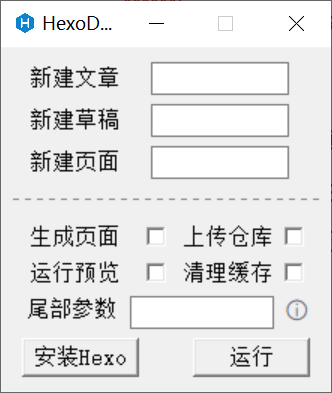
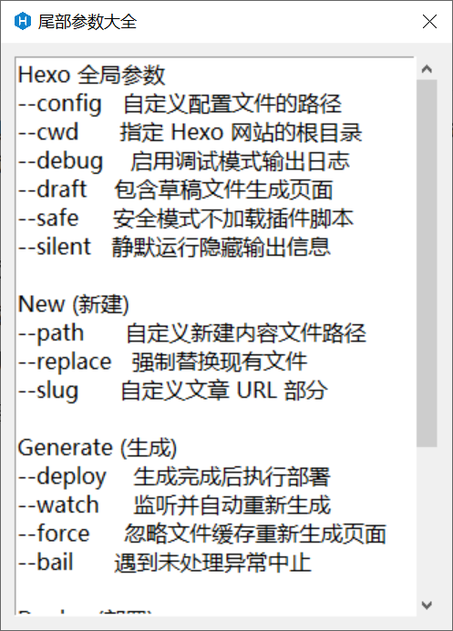

# HexoDash

一个用于Hexo博客的GUI命令助手，通过GUI页面快速完成新建文章、运行生成、部署和预览等常用操作，免去开终端输入命令的麻烦。

## 功能

1. 快速新建文章、草稿、页面
2. 快速运行组合命令，如生成页面、预览页面
3. 支持带上尾部参数进行调试
4. 一键在当前目录下创建blog文件夹安装Hexo

博文链接：https://teahush.link/%E7%BC%96%E7%A8%8B/HexoDash

## 软件页面

## 尾部参数大全

| **Hexo 全局参数**   |                          |
| ------------------- | ------------------------ |
| `--config`          | 自定义配置文件的路径     |
| `--cwd`             | 指定 Hexo 网站的根目录   |
| `--debug`           | 启用调试模式输出日志     |
| `--draft`           | 包含草稿文件生成页面     |
| `--safe`            | 安全模式不加载插件脚本   |
| `--silent`          | 静默运行隐藏输出信息     |
| **New (新建)**      |                          |
| `--path`            | 自定义新建内容文件路径   |
| `--replace`         | 强制替换现有文件         |
| `--slug`            | 自定义文章 URL 部分      |
| **Generate (生成)** |                          |
| `--deploy`          | 生成完成后执行部署       |
| `--watch`           | 监听并自动重新生成       |
| `--force`           | 忽略文件缓存重新生成页面 |
| `--bail`            | 遇到未处理异常中止       |
| **Deploy (部署)**   |                          |
| `--generate`        | 部署前先生成静态文件     |
| **Server (服务器)** |                          |
| `--port`            | 指定运行端口             |
| `--host`            | 指定运行IP               |
| `--static`          | 禁用监听文件变化         |
| `--log`             | 启用日志，输出事件信息   |